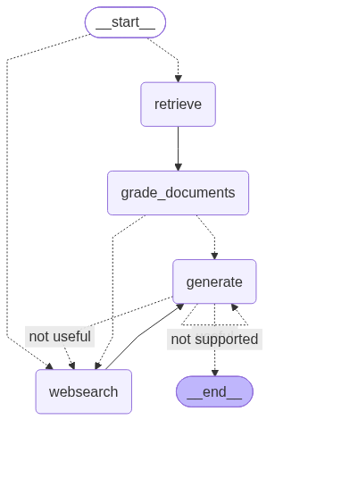

# Agentic RAG with LangGraph

A RAG app that checks its own work. It looks up answers in a local vector store first, checks whether the results are actually useful, and falls back to a web search when they're not. It also checks the final answer before returning it.

Built with LangGraph, Chroma, and Tavily.

## How it works



The flow is a graph with four steps:

1. **retrieve**: pulls the closest chunks from the Chroma vector store.
2. **grade_documents**: checks whether each chunk is relevant to the question. If the chunks aren't useful, it goes to web search.
3. **websearch**: searches the web with Tavily and adds the results as context.
4. **generate**: writes the answer from the context.

Two checks run after `generate`:

- **Not supported**: the answer isn't backed by the context, so it generates again.
- **Not useful**: the answer doesn't really answer the question, so it goes to web search.

If the answer passes both checks, it's returned. A question can also skip the vector store and go straight to web search when it clearly isn't covered by the stored docs.

## Knowledge base

`ingestion.py` loads three posts from Lilian Weng's blog:

- LLM Powered Autonomous Agents
- Prompt Engineering
- Adversarial Attacks on LLMs

They're split into chunks of 250 tokens (no overlap), embedded with `sentence-transformers/all-MiniLM-L6-v2`, and saved to a local Chroma database in `./.chroma`.

## Tech used

- Python 3.13+
- LangGraph and LangChain
- Chroma (vector store)
- Hugging Face embeddings (`all-MiniLM-L6-v2`, runs on your machine)
- Groq (`langchain-groq`) for the LLM
- Tavily for web search
- python-dotenv

## Files

```
.
├── main.py           # runs the graph on a sample question
├── ingestion.py      # loads the blog posts and builds the Chroma store
├── graph/            # the LangGraph app (nodes, checks, and graph.py)
├── graph.png         # picture of the graph
├── pyproject.toml
├── uv.lock
├── .python-version
└── .gitignore
```

## Setup

```bash
git clone -b agentic-rag https://github.com/IshwarRajChauhan/langchain-Personal.git
cd langchain-Personal
uv sync
```

Make a `.env` file:

```env
GROQ_API_KEY=your_groq_api_key
TAVILY_API_KEY=your_tavily_api_key
```

Keys: [Groq Console](https://console.groq.com/) and [Tavily](https://tavily.com/).

## Run it

Build the vector store first (one time):

```bash
uv run ingestion.py
```

Then ask a question:

```bash
uv run main.py
```

`main.py` runs this sample question:

```
what is agent memory?
```

To try your own, change the `question` in `main.py`.

## Things to know

- The stored docs only cover agents, prompt engineering, and LLM attacks. Questions outside that go to web search.
- The first run downloads the embedding model.
- Tests can be run with `pytest`.

## To do

- [ ] Add more sources to the knowledge base
- [ ] Add tests for each graph step
- [ ] Add a simple UI
- [ ] Cap the number of retries so it can't loop forever
